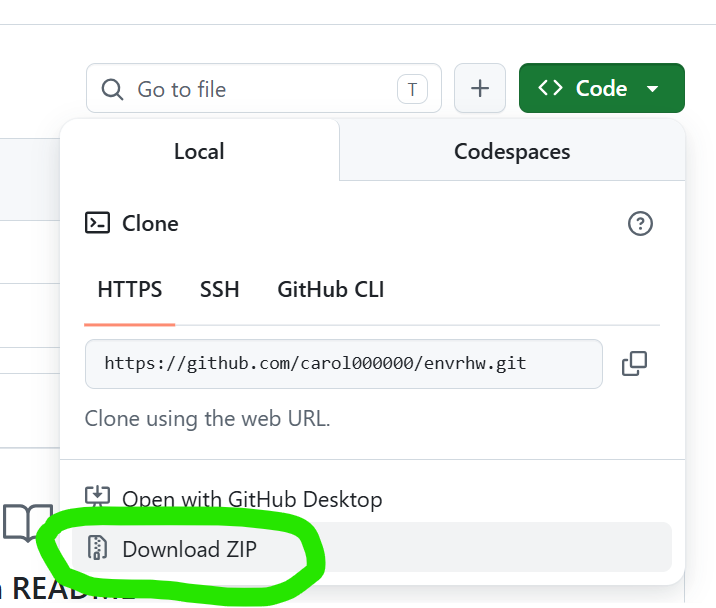

# Introduction to Chung Hsing New Village

>Image and panorama source: Google Street View

## How to Download and Install
-[Download Python](https://www.python.org/downloads/)
<br>
-[Download Visual Studio Code](https://code.visualstudio.com/)

<br>
-Download and extract the files
-Open the folder
-Open the terminal and type:
```Bash
pip install ursina
```
-Run the program:
```Bash
python Main.py
```
<br>
## Controls

| Action   | Description                          |
|----------|--------------------------------------|
| Rotate   | Right-click and drag                 |
| Zoom     | Scroll the mouse wheel               |
| Next/Back| Switch scenes                        |
| Map      | Toggle the map                       |
| Info     | View information and audio guide     |
---
# 介紹中興新村

>圖片與全景素材來源：Google 街景服務 (Google Street View)

## 如何下載與安裝
-[安裝Pythone](https://www.python.org/downloads/)
<br>
-[安裝Pythone](https://code.visualstudio.com/)

<br>
-下載後解壓縮
-開啟檔案
-在終端機輸入
```Bash
pip install ursina
```
-執行
```Bash
python Main.py
```
<br>
## 操作說明

| 操作         | 說明             |
|-------------|------------------|
| 旋轉視角     | 滑鼠右鍵拖曳      |
| 縮放        | 滑鼠滾輪          |
| Next / Back | 切換景點          |
| 地圖        | 開關地圖          |
| 資訊        | 查看資訊與語音導覽 |